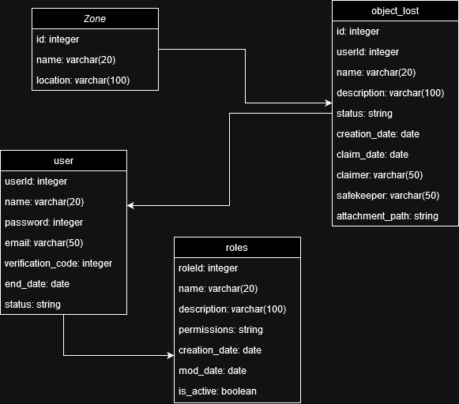

# lab-mngmt-api

> <http://localhost:5001>

1. create virtual env: `python3 -m venv venv`
2. create .env file
3. run pip3 install -r requirements.txt
4. If you are using vs code, go to `run and debug` and create a launch.json file and add the following (for env file, copy your path and paste it):
   { "version": "0.2.0",
   "configurations": [
   {
   "name": "Python: Current File",
   "type": "debugpy",
   "request": "launch",
   "program": "./app.py",
   "console": "integratedTerminal",
   "envFile": ".env"
   }
   ]
   }

5. Run the project under 'Run and debug'

# Docker Containers

## Common commands in Docker

-   **docker pull**: it pulls images from Docker Hub to local computer
    > docker pull debian
-   **docker push**: it pusches the container image into an image registry (e.g. docker hub).

    > docker push myimage

-   **docker build**: it creates a new image based on a existing image.

    > docker build -t myimage .

    -t --> it is used to specify an image name.  
     . --> it is used to specify the path where it needs to find the Dockerfile

-   **docker run**: it creates a new container based on an image.

    > docker run -dp 3000:3001 --name mycontainer myimage

    **-d** --> it indicates the container will run in background  
    **-p** --> it indicates the ports (**external:internal**) where the container will run 
    **--name** --> it indicates the container name.

-   **docker image**: it displays all images created in docker
-   **docker ps**: it displays all containers are running.
-   **docker stop**: it stops a container
    > docker stop mycontainer
-   **docker rm**: it removes/deletes a container
    > docker rm mycontainer
-   **docker rmi**: it removes/deletes an image
    > docker rmi myimage
-   **docker restart**: it restarts a container
    > docker restart mycontainer
-   **docker container exec -it < containerId > ls < pathToDirectory > **: It is to go into a specific folder in a container

-   **docker network create**: it creates a new network inside of Docker
    > docker network create mynetwork-name
-   **docker network rm**: it removes an existing network inside of Docker
    > docker network rm mynetwork-name
-   **docker inspect < containerId >**: It inspects and displayes the container configuration
    > Example: docker inspect fe09ab279e47
-   Running a container in a network
    > docker run -dp 50001:50001 --network mynetwork-name --network-alias myalias --name mycontainer-name myimage-name
-   Running a container and sending it environment variables

    > docker run -dp 50001:50001 --network mynetwork-name -e USER_DB=myuserdb -e PASSWORD=123x21 --name mycontainer-name myimage-name

-   Running docker compose

    > docker-compose up --build  
    > docker-compose --env-file build.env up --build

    **--env-file** --> to specify the env file with environment variables  
     
     

# Working with Docker containers

## Running every project separately on container

-   docker build -t image-name-you-want-to-specify

> **Example:** doker build -t utn/student-service-api-image

## Creating a container based on the image created previously

-   docker run -dp 50001:5001 --name docker-name-you-want-specify image-name-you-specified

> **Example:** docker run -dp 5001:5001 --name utn/student-service-api utn/student-service-api-image

## Running all restapi projects using docker compose

-   docker-compose up --build
